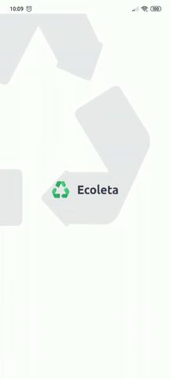

<h4 align="center">

  
♻️ Seu marketplace de coleta de resíduos ♻️
</h4>

  
  

# :bulb: Sobre o projeto
**Ecoleta** é um projeto que tem como finalidade ajudar pessoas que tenham o interesse de descartar resíduos da maneira correta para que sejam reciclados e reaproveitados.
Este projeto foi desenvolvido durante a Next Level Weak 1 realizada pela [**Rocketseat**](https://rocketseat.com.br/), que tinha como finalidade apresentar a stack **ReactJs**, **React Native** e **NodeJs**.

# Teste online
[**Site**](https://web.dgspace.com.br/)

[**App pelo appetize**](https://expo.io/appetize-simulator?url=https://expo.io/@davi-faustino/dg-ecoleta)

**App pelo Expo**

## Site Ecoleta
Caso queira baixar o projeto basta entrar na pasta [**web**](https://github.com/davi-faustino/Ecoleta/tree/master/web) e seguir os passos para instalação.

## App Ecoleta
[**Página do projeto no Expo**](https://expo.io/@davi-faustino/dg-ecoleta)

Caso queira baixar o projeto basta entrar na pasta [**mobile**](https://github.com/davi-faustino/Ecoleta/tree/master/mobile) e seguir os passos para instalação.

